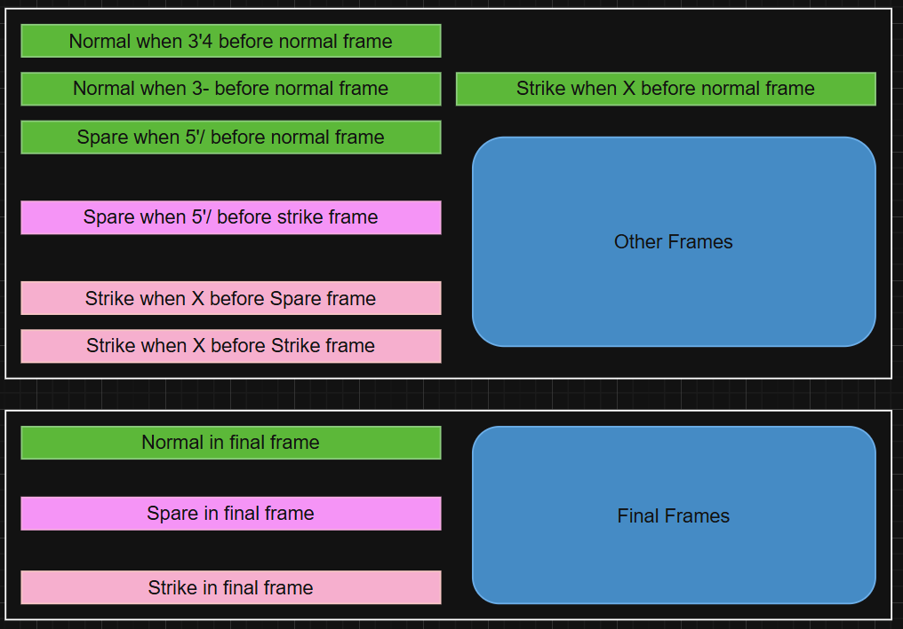

## Summary

- Create a program that, given a valid sequence of rolls for one line of American Ten-Pin Bowling, produces the total score for the game.

## Scope

- It will not check for valid rolls.
- It will not check for the correct number of rolls and frames.
- It will not provide scores for intermediate frames.

## Tasks Breakdown

## 🧪 Suggested Test Cases

| Rolls                                | Description                                      | Final Score |
|-------------------------------------|--------------------------------------------------|-------------|
| `X X X X X X X X X X X X`           | 12 rolls: 12 strikes                             | `300`       |
| `9- 9- 9- 9- 9- 9- 9- 9- 9- 9-`      | 20 rolls: 10 pairs of 9 and miss                 | `90`        |
| `5/ 5/ 5/ 5/ 5/ 5/ 5/ 5/ 5/ 5/5`    | 21 rolls: 10 spares of 5, ending with a 5 bonus  | `150`       |

---